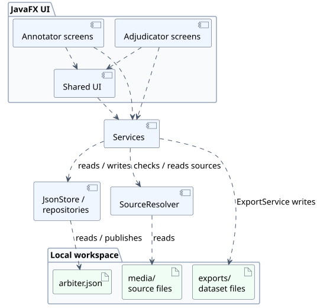
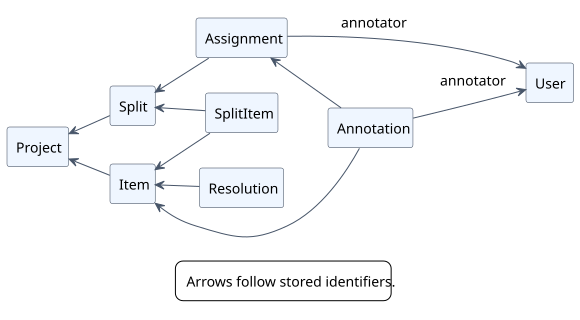
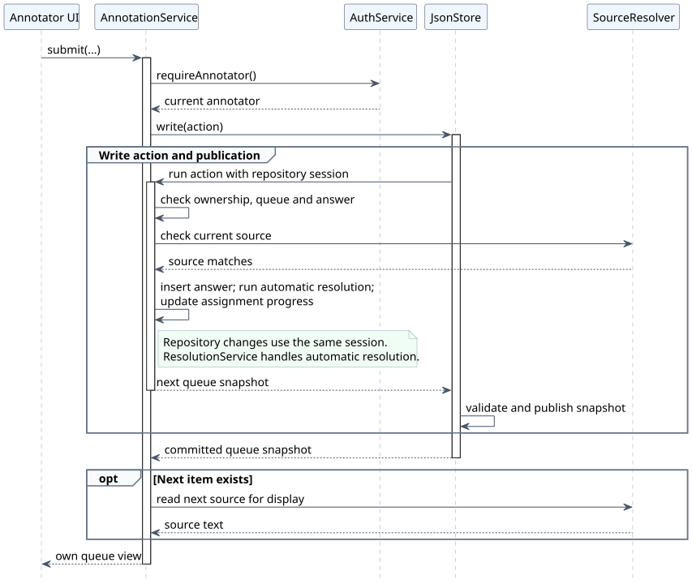
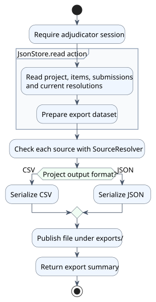

# Developer Guide

This guide covers setup, the main design choices and development checks. Product behaviour is specified in [User Flows](UserFlows.md) and its linked feature issues; terms are defined in the [Glossary](Glossary.md).

## Setting up

Use **JDK 25** and run these commands from the repository root. The Gradle wrapper downloads Gradle and the declared dependencies, including JavaFX; uncached downloads need network access.

| Task | Command |
| --- | --- |
| Run the app | `./gradlew run` |
| Run tests and Checkstyle | `./gradlew check` |
| Build `build/libs/arbiter.jar` | `./gradlew shadowJar` |
| Seed a demo workspace | `./gradlew seedDemo` |

On Windows, use `.\gradlew.bat` instead of `./gradlew`. Release launch instructions and supported platforms are in the [README](https://github.com/CS3227-2610-MP2-Arbiter/CS3227-2610-MP2#running-a-release).

The demo task uses `build/demo-workspace`, or the folder supplied with `-PdemoWorkspace=<folder>`. The target must be new or empty. Demo accounts and scenarios are in the [Smoke Checklist](SmokeChecklist.md).

**Diagrams.** Editable PlantUML sources and their rendered SVGs live together in `docs/diagrams/`. To regenerate the images with a local [PlantUML jar](https://plantuml.com/command-line) and [Graphviz support](https://plantuml.com/graphviz-dot) for the class diagram, run `java -jar <path-to-plantuml.jar> -tsvg "docs/diagrams/*.puml"` from the repository root.

## Design

The [shared workspace (rule 11)](UserFlows.md#3-rules-both-tracks-share) gives both roles the same saved project state. This avoids a server and a package-exchange or merge protocol, at the cost of taking turns using the workspace. The file lock coordinates Arbiter instances; on a shared disk, that coordination depends on the filesystem's locking support.

The implementation uses JavaFX, services and a JSON snapshot. It has no dependency-injection framework; `Arbiter` constructs the services and passes them to screens explicitly. This keeps construction visible in the application, at the cost of maintaining that wiring by hand.

### Architecture

The UML component diagram groups the main interaction paths; it is not a complete package dependency map. Dashed arrows show use dependencies.

[Diagram source](diagrams/architecture.puml).

Separating screen interactions from persistence lets service logic be tested without launching the UI. Package responsibilities and implementation constraints are maintained in [architecture context](https://github.com/CS3227-2610-MP2-Arbiter/CS3227-2610-MP2/blob/main/context/architecture.md).

The roles share `AnnotationEditor` and `ItemView` so their classification controls and source display can be maintained together. Sharing controls reduces duplication; access to data still needs the checks described under [Authorization and blindness](#authorization-and-blindness).

### Domain model

Records refer to related records by identifier, keeping the stored representation separate from the JavaFX controls. The UML class diagram shows selected associations through these identifiers. Fields, multiplicities and other associations, including taxonomy references, are omitted for readability.

[Diagram source](diagrams/domain-model.puml).

The [model Javadoc](https://github.com/CS3227-2610-MP2-Arbiter/CS3227-2610-MP2/tree/main/src/main/java/arbiter/model) defines the fields and optional references.

### Authorization and blindness

Role checks belong at service entry points because navigation alone cannot protect an operation. `AuthService` checks the stored account for protected operations; the [authorization rules](https://github.com/CS3227-2610-MP2-Arbiter/CS3227-2610-MP2/blob/main/context/architecture.md#authorization) describe this boundary. These are application checks, not restrictions on direct access to workspace files.

For [blindness (rule 1)](UserFlows.md#3-rules-both-tracks-share), annotator screens use the scoped `AnnotationService` entry points. Shared UI components do not by themselves establish this boundary. The static checks and service tests described under [Testing](#testing) help detect violations.

### Persistence

**Snapshot transactions.** Keeping related records in one JSON snapshot allows a logical action to publish its repository changes together. A `JsonStore.write` action works on a private snapshot, which is validated before publication. An exception from the action prevents that snapshot from being published. The cost is reading and rewriting the snapshot, so storage work grows with workspace data.

**Publication and locking.** The store writes a temporary file beside the snapshot, flushes it and requests an atomic replacement. Publication depends on filesystem support; this is not a general guarantee against data loss. A publication I/O failure blocks subsequent store writes until reopening. The app also acquires a workspace file lock to coordinate Arbiter instances. Their implementation is described in [persistence context](https://github.com/CS3227-2610-MP2-Arbiter/CS3227-2610-MP2/blob/main/context/architecture.md#persistence).

**Validation and versions.** Snapshot validation checks stored structure and references; feature rules also need service validation. Workspace layout and snapshot data have separate version checks. The current implementation rejects unsupported versions and has no migration path. Version checks avoid silently interpreting another data format; future schema work must follow the compatibility rule in the persistence context above.

**Source files.** Keeping sources in place avoids an additional copy but makes availability depend on those files remaining readable and unchanged ([rule 21](UserFlows.md#3-rules-both-tracks-share)). The resolver checks paths and content, including the stored hash, when reading. These checks detect source problems; they do not lock the media against external changes. Resolver responsibilities are in [source media context](https://github.com/CS3227-2610-MP2-Arbiter/CS3227-2610-MP2/blob/main/context/architecture.md#source-media-rule-21).

**Submission.** The answer, assignment progress and any automatic resolution are committed in the same write action. This avoids separate commits leaving those records out of step. Queue position is derived from saved work, as specified in [rule 18](UserFlows.md#3-rules-both-tracks-share); loading the next source for display happens after the write action.

The UML sequence diagram follows a successful submission. It highlights the write boundary and the later display read; error paths and individual repository calls are omitted.

[Diagram source](diagrams/submission.puml).

### Resolution and export

Separate resolution records allow both automatic results and adjudicator decisions to be represented without altering submissions ([rule 13](UserFlows.md#3-rules-both-tracks-share)). Resolution behaviour is specified in rule 10 of the same document.

Export builds a dataset from a snapshot before formatting it, so CSV and JSON can share the same data preparation. It checks sources before writing the output and does not change stored records. The output contract is in [#37]; implementation responsibilities are in [services context](https://github.com/CS3227-2610-MP2-Arbiter/CS3227-2610-MP2/blob/main/context/architecture.md#services).

The UML activity diagram shows this separation between reading stored data and publishing an export. A failed step exits through an exception; the diagram shows the successful path only.

[Diagram source](diagrams/export.puml).

**Adding an output format.** Review the saved `OutputFormat` value, export serialization and compatibility with existing workspaces together. Extend export tests for the agreed format and apply the schema-change rule under [Persistence](#persistence).

### Scope and tradeoffs

[#62] records the decision to focus v1 on text classification and the deferred work. Supporting another source or task type would require reviewing input handling, answer representation, resolution, export and data compatibility; there is no implemented extension mechanism for this.

The main tradeoffs are:

| Choice | Alternative | Cost |
| --- | --- | --- |
| Shared JSON snapshot | Relational database | Snapshot processing grows with workspace data |
| Workspace file lock | Concurrent writers with merge handling | Workspace use is serialised between Arbiter instances |
| Explicit service construction | Dependency-injection framework | Application wiring is maintained by hand |
| Shared classification controls | Separate controls for each role | Control changes need review in both workflows |

**Restricted text input.** The [input policy](https://github.com/CS3227-2610-MP2-Arbiter/CS3227-2610-MP2/blob/main/context/architecture.md#general) uses ASCII subsets for usernames, passwords, project names and label keys. This keeps their length checks and name comparisons within a limited character set, without introducing a Unicode normalisation policy for these fields. The tradeoff is excluding accented and non-Latin names and limiting password character choices.

### Errors and logging

A shared error convention keeps message handling and diagnostics together. Its implementation rules are in [UI context](https://github.com/CS3227-2610-MP2-Arbiter/CS3227-2610-MP2/blob/main/context/architecture.md#ui). Diagnostics use JDK logging, with rotating files when a workspace log is attached; startup can continue with console logging if attaching the file log fails.

## Software engineering process

The task workflow, skill responsibilities and human approval steps are defined in [`context/swe.md`](https://github.com/CS3227-2610-MP2-Arbiter/CS3227-2610-MP2/blob/main/context/swe.md). Task-specific instructions live in [`.codex/skills/`](https://github.com/CS3227-2610-MP2-Arbiter/CS3227-2610-MP2/tree/main/.codex/skills).

The skills used in that workflow are:

| Work | Skills |
| --- | --- |
| Agree requirements and plan | `clarify-requirements`, `write-plan` |
| Implement and test | `implement-feature`, `write-test` |
| Verify and document | `review`, `maintain-docs` |
| Prepare delivery | `create-pull-request` |

The `log` skill records task requests, corrections, outcomes and verification in [`logs/`](https://github.com/CS3227-2610-MP2-Arbiter/CS3227-2610-MP2/tree/main/logs) for human review. Humans retain responsibility for scope, design decisions, acceptance and merging; a recorded agent check is evidence for that review, not human acceptance.

**Markdown.** Keep each paragraph, bullet or table row on one source line and let the viewer wrap it. The Java line limit does not apply.

**CI.** The [Java workflow](https://github.com/CS3227-2610-MP2-Arbiter/CS3227-2610-MP2/blob/main/.github/workflows/gradle.yml) runs build checks on Linux, macOS and Windows and smoke-launches the release jar on a plain JDK. The launch check observes startup, not the full user workflow. The [Pages workflow](https://github.com/CS3227-2610-MP2-Arbiter/CS3227-2610-MP2/blob/main/.github/workflows/pages.yml) builds documentation changes and deploys from the default branch.

## Testing

Automated tests live in `src/test/java`. Many service tests and the repository tests use temporary JSON workspaces; model and helper tests can run without persistent storage. Shared fixtures reduce repeated setup; they do not replace tests of each feature's behaviour.

- **Persistence and refusals:** tests exercise writes, reopening, validation and selected failure cases. Some refusal tests compare snapshot bytes before and after to check that stored data did not change.
- **Architecture:** `AnnotatorBlindnessTest` checks selected static access paths from annotator-facing UI code. It trusts scoped service entry points, whose behaviour needs separate service tests. `UiConventionTest` checks specified UI conventions. These checks do not prove the absence of every possible information leak or UI defect.
- **UI and acceptance:** automated tests cover some routing and layout. Full workflows and visual behaviour still need human checks using the task's agreed scenarios and the [Smoke Checklist](SmokeChecklist.md).

Use the commands under [Setting up](#setting-up) for local checks; the development process defines the required verification for a change.

## Acknowledgements

- The inherited Checkstyle configuration follows the [SE-Education Java coding standard](https://se-education.org/guides/conventions/java/intermediate.html).
- Pages automation follows the official [GitHub Pages workflow documentation](https://docs.github.com/en/pages/getting-started-with-github-pages/using-custom-workflows-with-github-pages).
- [JavaFX](https://openjfx.io/) provides the desktop UI.
- [JUnit](https://junit.org/junit5/) and [ArchUnit](https://www.archunit.org/) support automated testing.
- [Gradle](https://gradle.org/) and the [Shadow plugin](https://gradleup.com/shadow/) build the release jar.
- [Jackson](https://github.com/FasterXML/jackson) handles snapshot JSON and export serialization.

[Back to home](index.md)

[#37]: https://github.com/CS3227-2610-MP2-Arbiter/CS3227-2610-MP2/issues/37
[#62]: https://github.com/CS3227-2610-MP2-Arbiter/CS3227-2610-MP2/issues/62
