# User Guide

Arbiter has [two roles](index.md#the-two-roles), and you see a different interface depending on which one you have. [User Flows](UserFlows.md) shows what each role does.

## Getting started

1. Launch Arbiter, as the [README](https://github.com/CS3227-2610-MP2-Arbiter/CS3227-2610-MP2#running-a-release) describes. On first run the workspace wizard asks you to choose a [workspace](Glossary.md) folder.
2. During setup, create the workspace's sole adjudicator account. Keep its password safe: Arbiter cannot recover or reset it ([rule 12](UserFlows.md#3-rules-both-tracks-share)).
3. The adjudicator creates annotator accounts on the [Accounts](#accounts) screen and gives each annotator their username and password. There is no self-signup and no email: an annotator who forgets their password asks the adjudicator, who sets a new one directly ([rule 12](UserFlows.md#3-rules-both-tracks-share)).
4. Sign in. Arbiter opens your role's home: [Projects](#projects) for the adjudicator, and [My splits](#my-splits) for annotators.

If the workspace is already in use, close its other Arbiter instance and try again.

If Arbiter says it could not finish something, the details are in the workspace's `logs/arbiter.0.log`. Include that file when you report the problem; it never contains passwords.

## Quick reference

Choose a task to jump to its instructions.

| I want to... | Role | Instructions |
| --- | --- | --- |
| Label plain-text items | Annotator | [My splits](#my-splits) |
| Track my split progress | Annotator | [My splits](#my-splits) |
| Create, reset or deactivate annotator accounts | Adjudicator | [Accounts](#accounts) |
| Create a project and import files | Adjudicator | [Create a project and register files](#create-a-project-and-register-files) |
| Configure labels or a rating range | Adjudicator | [Set the taxonomy](#set-the-taxonomy) |
| Make batches and assign annotators | Adjudicator | [Create splits and assign work](#create-splits-and-assign-work) |
| Monitor progress and resolve disputes | Adjudicator | [Monitor and resolve](#monitor-and-resolve) |
| Export the dataset | Adjudicator | [Export](#export) |

## Projects

Projects is the adjudicator's home screen. It lists every [project](Glossary.md) with its taxonomy kind, output format and progress counts. Choose **Open** on a project's row to work on its files and splits; **Back** returns to the list.

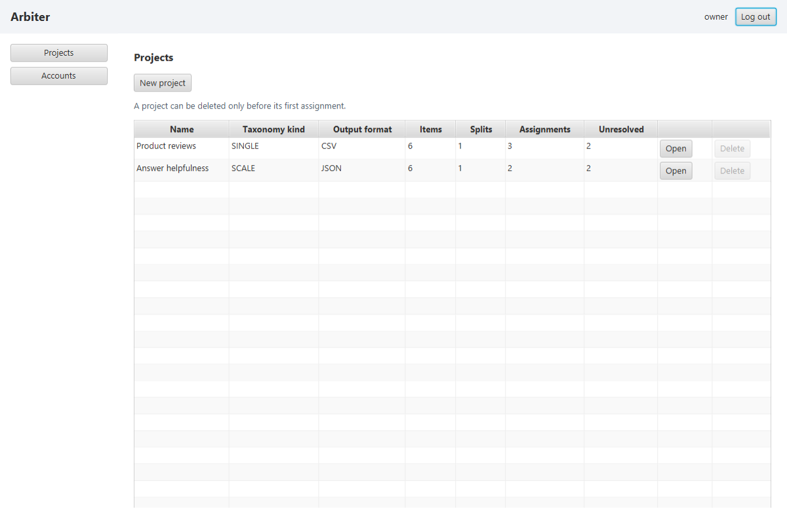

### Create a project and register files

- **Create a project.** Choose **New project**, enter a unique name and an optional description, and pick a [taxonomy kind and output format](Glossary.md#fixed-value-sets). Neither can be changed later ([rule 4](UserFlows.md#3-rules-both-tracks-share)).

  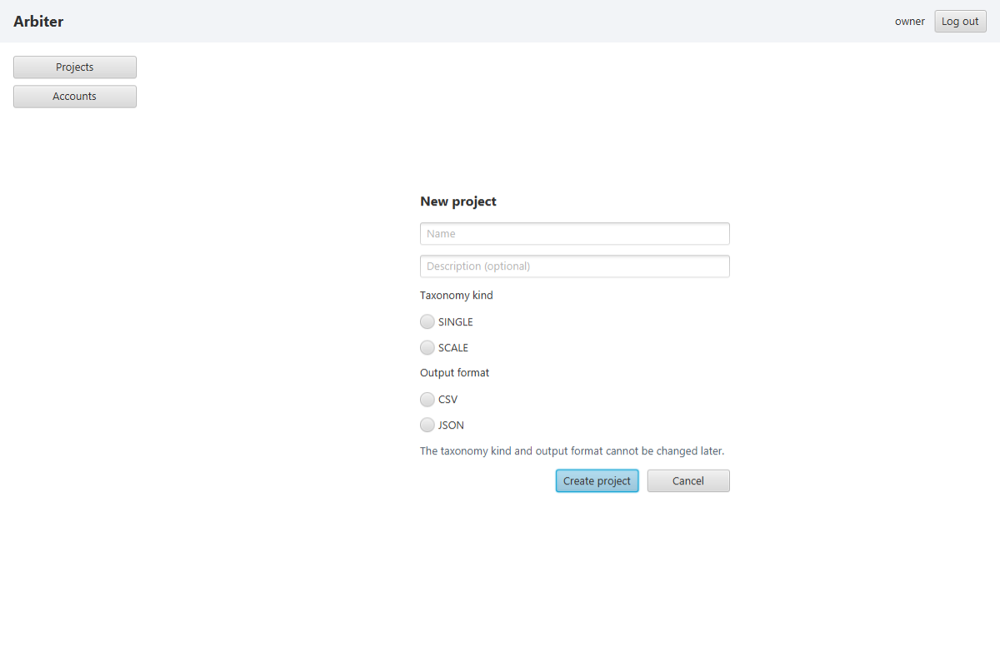

- **Delete a project.** Choose **Delete** on its row and confirm. You can delete a project only before its first assignment, and its source files in `media/` are kept ([rule 5](UserFlows.md#3-rules-both-tracks-share)).
- **Register files.** Put the plain-text `.txt` files in the workspace's `media/` folder, open the project, choose **Add files...** and select them. Wait for **Files registered** before continuing. Arbiter records each file's location and content hash without copying it ([registration in place](Glossary.md)). If any file is rejected, none from that selection are registered. Correct the file named in the message and try again.
- **Unregister a file.** On the project page, choose **Unregister** on its row and confirm. The source file stays in `media/`. You can unregister only before the project's first assignment ([rule 3](UserFlows.md#3-rules-both-tracks-share)).

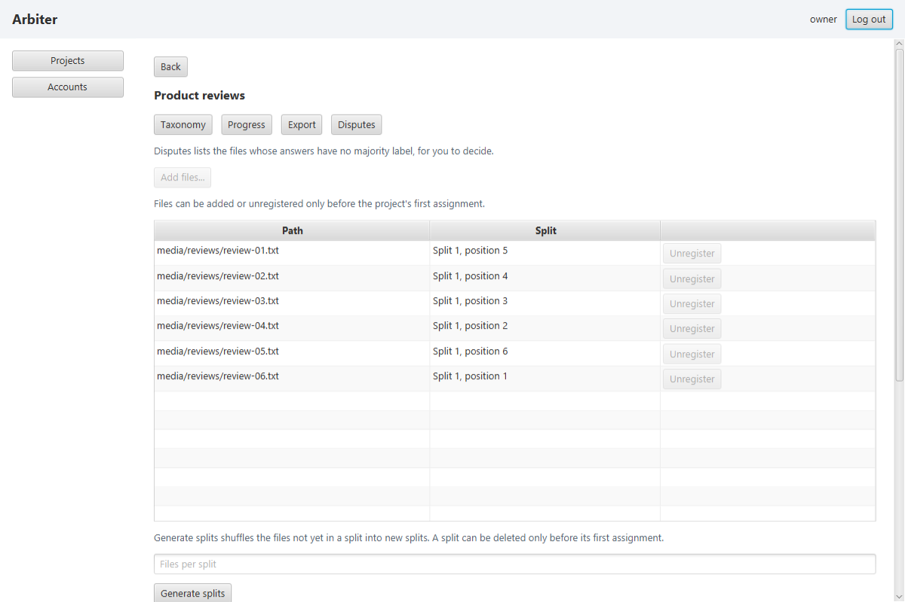

### Set the taxonomy

On the project page, choose **Taxonomy**. For `SINGLE`, enter a key and optional description for each [label](Glossary.md), choose **Save**, then use **Up** and **Down** to order them. For `SCALE`, enter the minimum and maximum whole-number ratings and choose **Save**. The first assignment needs at least two `SINGLE` labels or a saved `SCALE` range. You can change the taxonomy only before the project's first assignment ([rule 3](UserFlows.md#3-rules-both-tracks-share)).

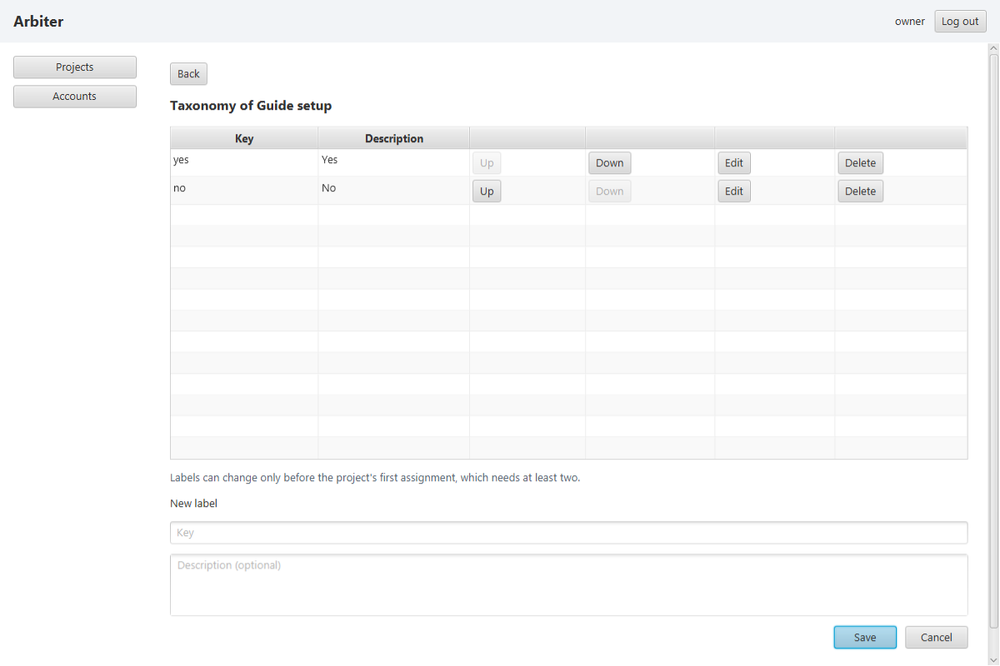

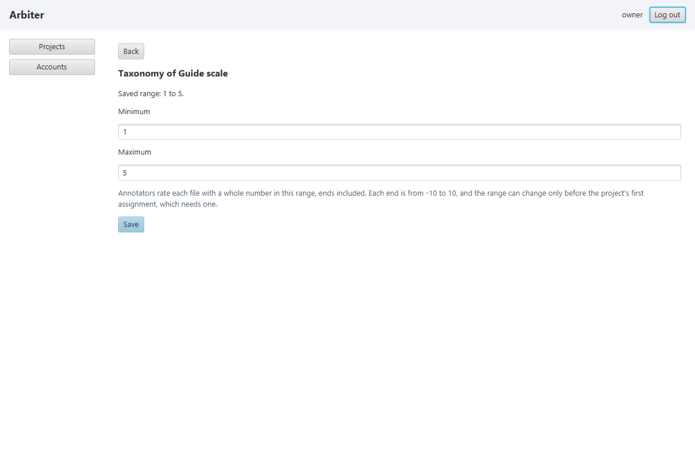

### Create splits and assign work

- **Generate splits.** On the project page, enter the number of files per split, choose **Generate splits** and confirm the sizes shown. Arbiter shuffles the files not yet in a split into new splits, and the **Split** column shows each file's split and position ([rule 7](UserFlows.md#3-rules-both-tracks-share)).
- **Delete a split.** Choose **Delete** on its row and confirm. Its files return to those not yet in a split. You can delete a split only before its first assignment ([rule 14](UserFlows.md#3-rules-both-tracks-share)).

  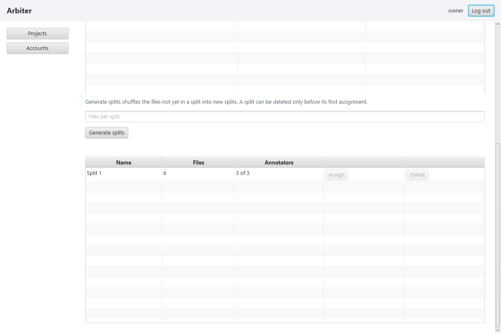

- **Assign annotators.** On the project page, choose **Assign** on a split's row. The form shows the split's assigned annotators and active annotators you can add. On its first assignment, set [*k*](Glossary.md), the number of independent answers per file. Select one or more annotators, choose **Assign** and confirm. You can fill remaining places later, but cannot change *k* or remove or move assignments; deactivation does not free a place ([rule 19](UserFlows.md#3-rules-both-tracks-share)). Create annotators first on [Accounts](#accounts) if needed.

  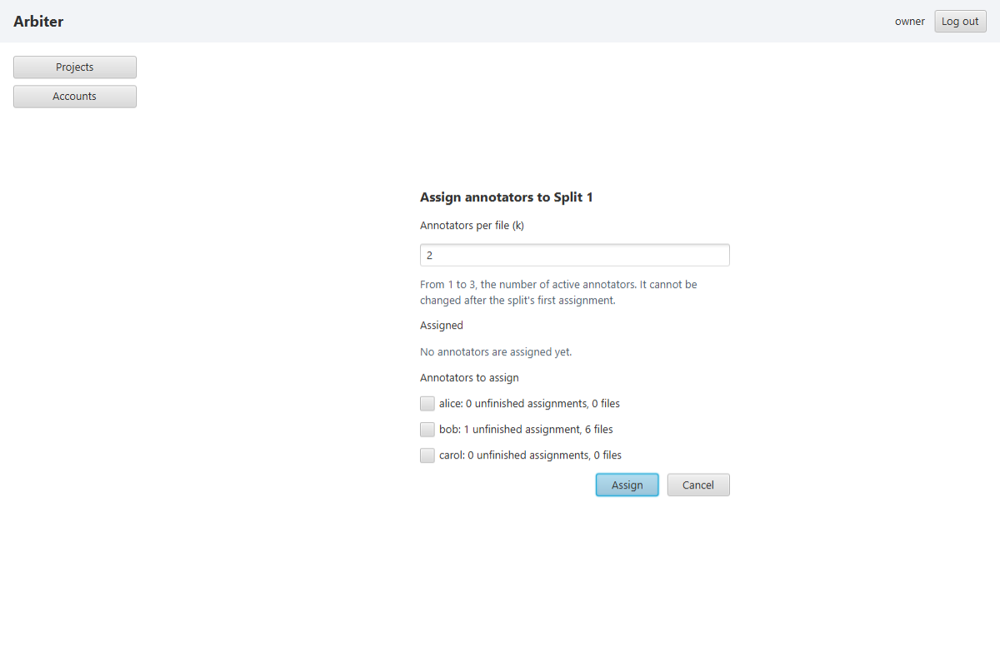

### Monitor and resolve

- **Monitor progress.** On the project page, choose **Progress** to see current project, split and annotator counts. Unresolved files include incomplete work; only completed `SINGLE` disagreements appear as disputes ([rule 10](UserFlows.md#3-rules-both-tracks-share)). Select a split to see its assignments, choose **Refresh** to reload, or use **Assign** and, for `SINGLE`, **Disputes** to open those screens.

  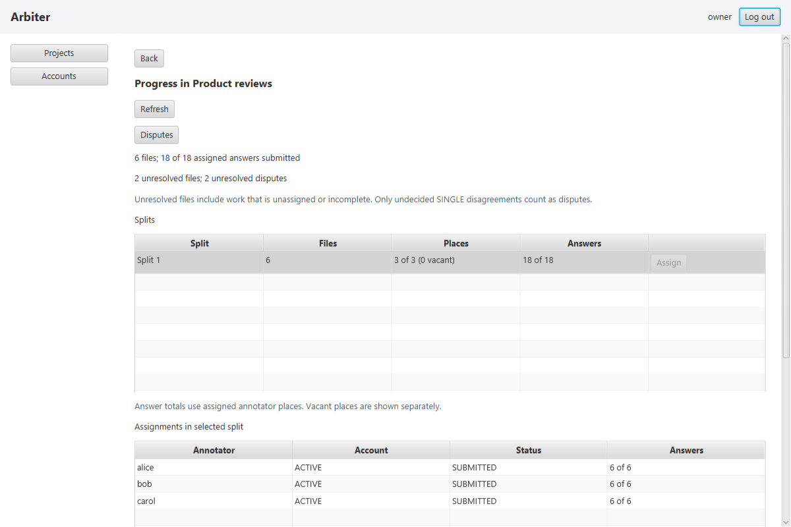

- **Resolve a dispute.** On a `SINGLE` project's page, choose **Disputes** to list its undecided [disputes](Glossary.md) and files you have decided. Choose **Open** to compare a file's text and submitted labels without annotator names, pick one of the project's labels and choose **Save**. You can replace your own decision, but cannot change an automatic resolution; submitted answers remain fixed ([rule 13](UserFlows.md#3-rules-both-tracks-share)). Once *k* ratings are submitted, a `SCALE` result is their automatic mean ([rule 10](UserFlows.md#3-rules-both-tracks-share)). If the file is missing or has changed, restore its original content before saving a manual decision ([rule 21](UserFlows.md#3-rules-both-tracks-share)).

  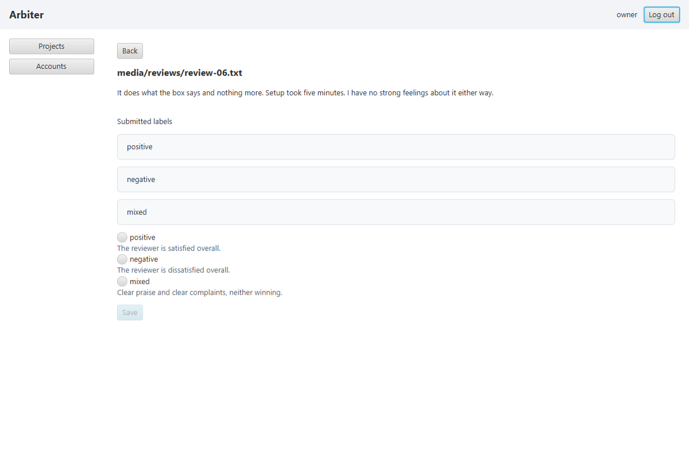

### Export

On the project page, choose **Export** at any stage. Check the resolved and unresolved counts and destination, then confirm to write the project's `CSV` or `JSON` file under `exports/`, replacing its earlier export. Each resolved item has its path, current answer and [provenance](Glossary.md): submitted answers with annotator names and times, plus the current resolution method and, for a manual decision, its decider and time. Unresolved items have their path and status, without an answer or submissions ([rule 15](UserFlows.md#3-rules-both-tracks-share)). CSV places submissions in numbered column groups; JSON nests them with the item. If a source is missing or changed, restore it and retry; Arbiter leaves the earlier export untouched ([rule 21](UserFlows.md#3-rules-both-tracks-share)). If another program has the destination open, close it and export again.

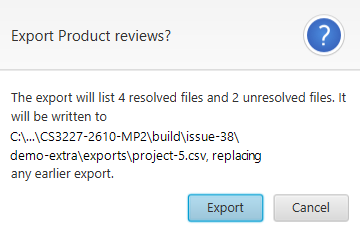

## My splits

My splits is an annotator's home screen. It lists only your own [assignments](Glossary.md), unfinished ones first. Each card shows the project and split, its status, and how many of its files you have answered and how many remain. Each file is one [item](Glossary.md) of the split.

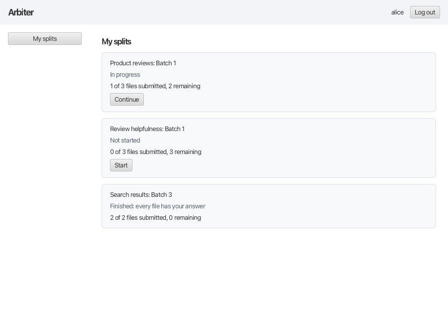

- **Start or continue a split.** Choose **Start** or **Continue** on its card. The split opens at the first file you have not answered, in its saved order, showing the file's text, its position such as "File 2 of 3", and the same progress counts as the card. **Back to My splits** returns to the list.
- **Choose an answer.** For a label project, pick one label; its description is shown beneath it. For a rating project, type a whole number within the range shown. **Submit & next** stays disabled until the answer is valid.

  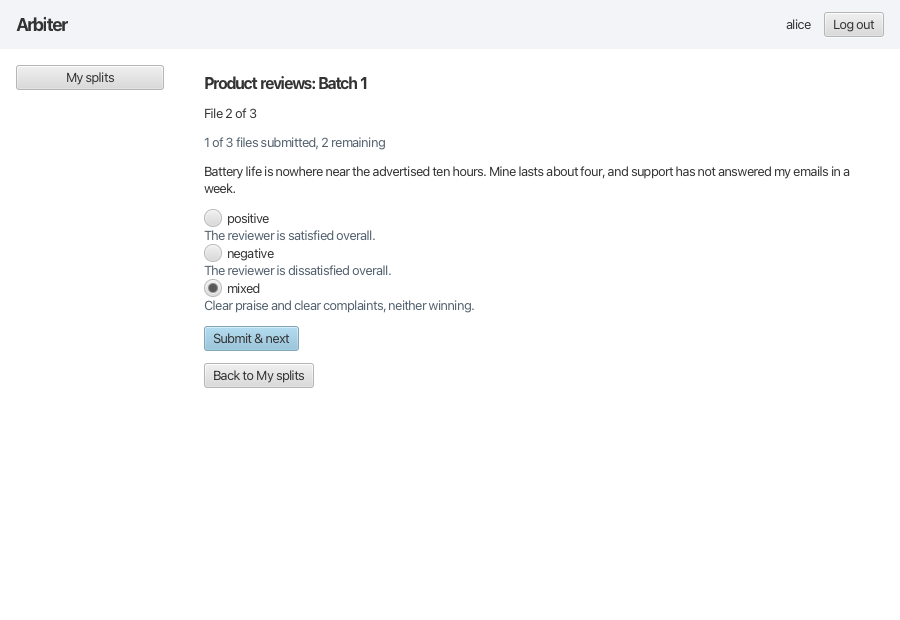

  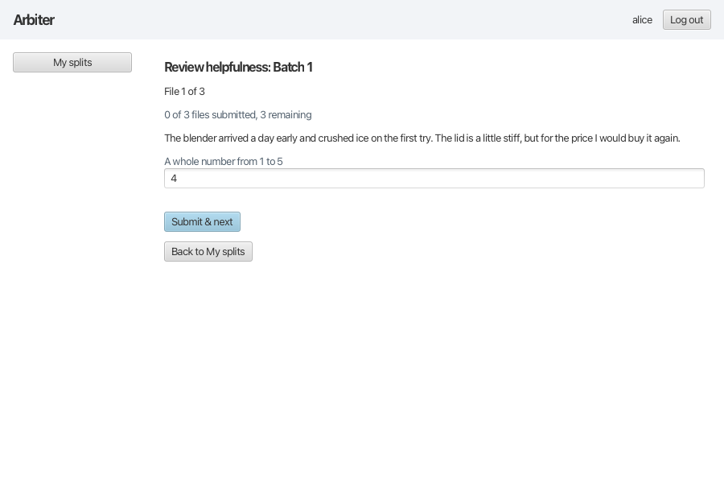

- **Submit & next.** Choose **Submit & next** to save your answer and move on to the next file. A submitted answer cannot be reopened or changed, by you or the adjudicator ([rules 13 and 18](UserFlows.md#3-rules-both-tracks-share)). When every file has your answer, the split is finished; its card says so and cannot be reopened. If submitting fails, nothing is saved and your choice stays on screen. If the file changed on disk after it was shown, the split says so instead.
- **Closing and coming back.** Your choice is not saved until you submit, so closing Arbiter first discards it ([rule 18](UserFlows.md#3-rules-both-tracks-share)). When you come back, the split opens at the first file you have not answered.
- **A file that cannot be read.** If a file is missing or has changed since it was registered, the split says so instead of showing its text. The file cannot be answered until your adjudicator restores it ([rule 21](UserFlows.md#3-rules-both-tracks-share)).
- **A project that is not set up yet.** Until the adjudicator has set up a project's labels or rating range, its files cannot be answered.

### What you never see

Annotation is blind ([rule 1](UserFlows.md#3-rules-both-tracks-share)). You see only your own assignments, answers and progress, never another annotator's, and never an item's resolved answer. File names and folders are hidden too, because they can hint at a label.

## Accounts

Accounts lists every account with its role and [status](Glossary.md#fixed-value-sets), the adjudicator first. Only the adjudicator sees it, and every account they create is an annotator ([rule 12](UserFlows.md#3-rules-both-tracks-share)).

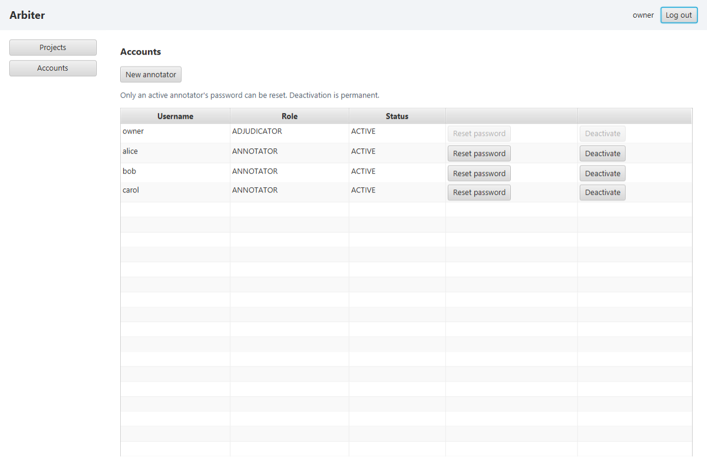

- **Create an annotator.** Choose **New annotator** and enter a username and the password twice. A username already taken in any letter case, even by a disabled account, is refused.
- **Reset a password.** Choose **Reset password** on an active annotator's row and enter the new password twice. The adjudicator's own password cannot be reset.
- **Deactivate an annotator.** Choose **Deactivate** on their row and confirm. They can no longer sign in, and their work and assignments are kept ([rule 19](UserFlows.md#3-rules-both-tracks-share)). Deactivation is permanent.

[Back to home](index.md)
